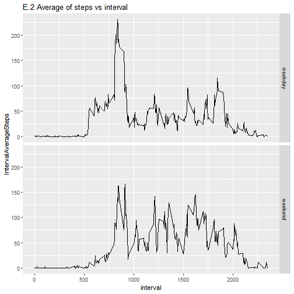

---


### A. Loading and preprocessing the data
Show any code that is needed to

1. Load the data (i.e. **`read.csv()`**)


```r
# A1. Load the data
unzip( './activity.zip')
activity = read.csv( './activity.csv' )
```


2. Process/transform the data (if necessary) into a format suitable for your analysis


```r
# A.2 Process/transform the data

library( tibble )
activity = as.tibble( activity )
```


### B. What is mean total number of steps taken per day?
For this part of the assignment, you can ignore the missing values in the dataset.

1. Calculate the total number of steps taken per day


```r
# B.1 Calculate the total number of steps taken per day 
library( dplyr )
library( lubridate )
DailySteps = activity %>% 
    group_by( date ) %>% 
    summarise( DailySteps = sum(steps, na.rm = TRUE) )

DailySteps
```

```
## # A tibble: 61 x 2
##    date       DailySteps
##    <fct>           <int>
##  1 2012-10-01          0
##  2 2012-10-02        126
##  3 2012-10-03      11352
##  4 2012-10-04      12116
##  5 2012-10-05      13294
##  6 2012-10-06      15420
##  7 2012-10-07      11015
##  8 2012-10-08          0
##  9 2012-10-09      12811
## 10 2012-10-10       9900
## # ... with 51 more rows
```


2. If you do not understand the difference between a histogram and a barplot, research the difference between them. Make a histogram of the total number of steps taken each day


```r
# B.2 histogram of the total number of steps 
library( ggplot2 )
qplot( DailySteps$DailySteps, main = 
           'B.2 Histogram of the total daily steps' )
```


3. Calculate and report the mean and median of the total number of steps taken per day


```r
# B.3 mean and median of the total number of steps 
summary(DailySteps$DailySteps)
```

```
##    Min. 1st Qu.  Median    Mean 3rd Qu.    Max. 
##       0    6778   10395    9354   12811   21194
```


### C. What is the average daily activity pattern?

1. Make a time series plot (i.e. **`type="l"`**) of the 5-minute interval (x-axis) and the average number of steps taken, averaged across all days (y-axis)


```r
# C.1 plot of interval and the average number of step
IntervalSteps = activity %>% 
    group_by( interval ) %>% 
    summarise( IntervalAverageSteps = mean(steps, na.rm = TRUE) )

qplot( data = IntervalSteps, x = interval, y = 
           IntervalAverageSteps, geom = 'line', main = 
           'C.1 Average of steps vs interval' )
```


2. Which 5-minute interval, on average across all the days in the dataset, contains the maximum number of steps?


```r
# C.2 Interval with the maximum number of steps 
top_n( IntervalSteps, n = 1, IntervalAverageSteps )
```

```
## # A tibble: 1 x 2
##   interval IntervalAverageSteps
##      <int>                <dbl>
## 1      835                 206.
```


### D. Imputing missing values

Note that there are a number of days/intervals where there are missing values (coded as **`NA`**). The presence of missing days may introduce bias into some calculations or summaries of the data.

1. Calculate and report the total number of missing values in the dataset (i.e. the total number of rows with **`NA`**s)


```r
# D.1 total number of missing values 
sum( is.na( activity$steps ) )
```

```
## [1] 2304
```


2. Devise a strategy for filling in all of the missing values in the dataset. The strategy does not need to be sophisticated. For example, you could use the mean/median for that day, or the mean for that 5-minute interval, etc.

---

> Answer:  

I decided to fill the missing values with the average of the 5-minute interval across all days:  

**Step 1**: Crossing the original data, object 'activity', with the object 'IntervalSteps' calculated on chapter C.1.  

**Step 2**: selecting the correct datum, depending if the
original is NA or not   

**Step 3**: selecting the final columns

>  

---

3. Create a new dataset that is equal to the original dataset but with the missing data filled in.


```r
# D.3 new dataset with the missing data filled in
activity_complete = activity %>%
    left_join( y = IntervalSteps, by = 'interval' ) %>%
    mutate( steps = 
                ifelse( is.na( steps ), IntervalAverageSteps, 
                        steps ) ) %>%
    select( -IntervalAverageSteps )
activity_complete
```

```
## # A tibble: 17,568 x 3
##     steps date       interval
##     <dbl> <fct>         <int>
##  1 1.72   2012-10-01        0
##  2 0.340  2012-10-01        5
##  3 0.132  2012-10-01       10
##  4 0.151  2012-10-01       15
##  5 0.0755 2012-10-01       20
##  6 2.09   2012-10-01       25
##  7 0.528  2012-10-01       30
##  8 0.868  2012-10-01       35
##  9 0      2012-10-01       40
## 10 1.47   2012-10-01       45
## # ... with 17,558 more rows
```


4. Make a histogram of the total number of steps taken each day and Calculate and report the **mean** and **median** total number of steps taken per day. Do these values differ from the estimates from the first part of the assignment? What is the impact of imputing missing data on the estimates of the total daily number of steps?


```r
# D.4.1 Make a histogram of the total number of steps taken each day  

DailySteps_complete = activity_complete %>% 
    group_by( date ) %>% 
    summarise( DailySteps = sum(steps, na.rm = TRUE) )

qplot( DailySteps_complete$DailySteps, main = 
           'D.4.1 Histogram of the total daily steps, missing values averaged' )
```


```r
# D.4.1.2 Calculate and report the mean and median total 
# number of steps taken per day. 
print( 'Original data:' )
```

```
## [1] "Original data:"
```

```r
summary(DailySteps$DailySteps)
```

```
##    Min. 1st Qu.  Median    Mean 3rd Qu.    Max. 
##       0    6778   10395    9354   12811   21194
```

```r
print( 'Missing data filled with interval average:' )
```

```
## [1] "Missing data filled with interval average:"
```

```r
summary(DailySteps_complete$DailySteps)
```

```
##    Min. 1st Qu.  Median    Mean 3rd Qu.    Max. 
##      41    9819   10766   10766   12811   21194
```

> Answer:  

It is noticed that both, the median and the mean have increased

> 


### E. Are there differences in activity patterns between weekdays and weekends?
For this part **`weekdays()`** function may be of some help here. Use the dataset with the filled-in missing values for this part.

1. Create a new factor variable in the dataset with two levels: 'weekday' and 'weekend', indicating whether a given date is a weekday or weekend day.


```r
# E.1 new factor with 'weekday' and 'weekend'
activity_complete = activity_complete %>%
    mutate( Weekend = as.factor(ifelse( wday( as.Date(date), 
                                   week_start = 1 ) > 5,
                             'weekend', 'weekday' ) ) )

activity_complete
```

```
## # A tibble: 17,568 x 4
##     steps date       interval Weekend
##     <dbl> <fct>         <int> <fct>  
##  1 1.72   2012-10-01        0 weekday
##  2 0.340  2012-10-01        5 weekday
##  3 0.132  2012-10-01       10 weekday
##  4 0.151  2012-10-01       15 weekday
##  5 0.0755 2012-10-01       20 weekday
##  6 2.09   2012-10-01       25 weekday
##  7 0.528  2012-10-01       30 weekday
##  8 0.868  2012-10-01       35 weekday
##  9 0      2012-10-01       40 weekday
## 10 1.47   2012-10-01       45 weekday
## # ... with 17,558 more rows
```


2. Make a panel plot containing a time series plot (i.e. **`type="l"`**) of the 5-minute interval (x-axis) and the average number of steps taken, averaged across all weekday days or weekend days (y-axis). See the README file in the GitHub repository to see an example of what this plot should look like using simulated data.


```r
# E.2 panel plot of the interval across weekday / weekend  
IntervalSteps_weekend = activity_complete %>% 
    group_by( interval, Weekend ) %>% 
    summarise( IntervalAverageSteps = mean(steps, na.rm = TRUE) )

qplot( data = IntervalSteps_weekend, x = interval, y = 
           IntervalAverageSteps, geom = 'line', 
       facets = Weekend ~ ., 
       main = 'E.2 Average of steps vs interval' )
```




---

## Submitting the Assignment

To submit the assignment:

1. Commit your completed **`PA1_template.Rmd`** file to the **`master`** branch of your git repository (you should already be on the **`master`** branch unless you created new ones)

2. Commit your **`PA1_template.md`** and **`PA1_template.html`** files produced by processing your R markdown file with **`knit2html()`** function in R (from the knitr package) by running the function from the console.

> Answer: run **knit_files.R**

3. If your document has figures included (it should) then they should have been placed in the figure/ directory by default (unless you overrided the default). Add and commit the figure/ directory to your git repository so that the figures appear in the markdown file when it displays on github.

4. Push your **`master`** branch to GitHub.

5. Submit the URL to your GitHub repository for this assignment on the course web site.


In addition to submitting the URL for your GitHub repository, you will need to submit the 40 character SHA-1 hash (as string of numbers from 0-9 and letters from a-f) that identifies the repository commit that contains the version of the files you want to submit. You can do this in GitHub by doing the following:

1. Going to your GitHub repository web page for this assignment
2. Click on the “?? commits” link where ?? is the number of commits you have in the repository. For example, if you made a total of 10 commits to this repository, the link should say “10 commits”.
3. You will see a list of commits that you have made to this repository. The most recent commit is at the very top. If this represents the version of the files you want to submit, then just click the “copy to clipboard” button on the right hand side that should appear when you hover over the SHA-1 hash. Paste this SHA-1 hash into the course web site when you submit your assignment. If you don't want to use the most recent commit, then go down and find the commit you want and copy the SHA-1 hash.
